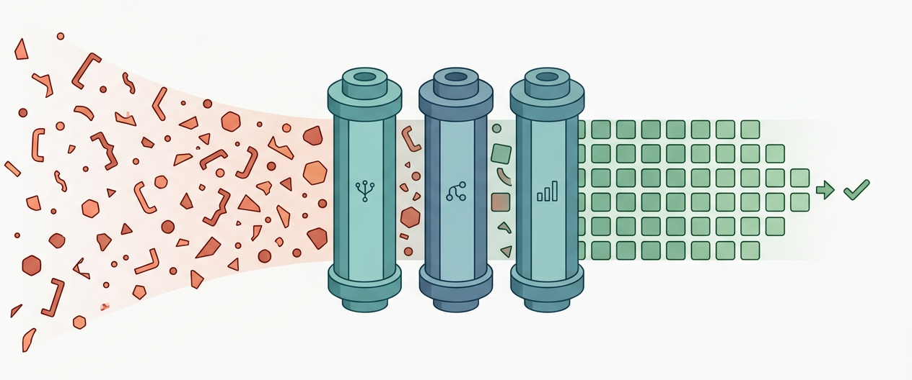

<div align="center">

<!-- Replace this line with the hero image once you generate one. See
     docs/HERO-IMAGE-PROMPT.md for the prompt to use with nano banana
     (Gemini 2.5 Flash Image) or any other text-to-image model. -->


# CleanTest-Agent

**Strip noise from unit-test training data in seconds, not hours --- with
rules where rules win, and an LLM only where it actually helps.**

[](https://github.com/jimmy0717/cleantest-agent/actions/workflows/ci.yml)
[](https://www.python.org/)
[](LICENSE)
[](https://github.com/anthropics/skills)
[](https://github.com/microsoft/methods2test)

[Quick start](#quick-start) ·
[Why this exists](#why-this-exists) ·
[Results](#results) ·
[How it works](#how-it-works) ·
[Skills usage](#use-it-from-a-coding-assistant) ·
[Paper](report/main.tex)

</div>

---

## What it does

CleanTest-Agent takes a CSV of `(focal_method, test_case)` pairs --- the
canonical format used by Methods2Test, ATLAS, and most modern test-generation
benchmarks --- and removes the noisy ones, leaving only the samples that
actually teach a model how to write good tests.

It does this through three composable Agent Skills (each follows the
`SKILL.md` protocol, so they drop directly into CodeBuddy, Claude Code,
or Cursor):

1. **Syntax filter** --- AST parsing with tree-sitter plus an Aho-Corasick
   automaton over a 21,954-pattern annotation dictionary.
2. **Relevance filter** --- AST name matching with an opt-in 5-rule LLM
   reflection step for borderline indirect-testing cases.
3. **Coverage filter** --- a JaCoCo-label scan by default, or a fine-tuned
   Qwen2.5-Coder-0.5B regression model when ground-truth labels are missing.

The whole pipeline processes 593,953 deduplicated Methods2Test samples in
under three minutes on a laptop. A single-LLM-per-sample baseline takes
~20 days and still misses 78% of the noise.

## Why this exists

The CleanTest paper (Zhang et al., FSE 2025 Distinguished Paper) showed
that 43.5% of the Methods2Test corpus is noisy, and that filtering the
noise improves downstream branch coverage by ~67% across CodeBERT,
AthenaTest, StarCoder, and CodeLlama-7B on Defects4J. Their pipeline is
effective but exists as one-shot scripts: hard to compose, hard to drop
into a coding assistant, and missing a path for projects that have no
JaCoCo labels.

This repository is a from-scratch reimplementation that splits the
pipeline into reusable skills, swaps the original CodeGPT coverage model
for a fine-tuned Qwen2.5-Coder-0.5B (~2.6x lower MAE), and adds an
optional Reflection step on the LLM relevance check. It is also the
source artefact for the companion 67-page paper under
[`report/`](report/).

## Use it if...

- ...you train code models on Methods2Test, ATLAS, or any
  `(focal_method, test)` corpus and want to remove noisy samples
  before training.
- ...you want a **rule-first** pipeline (deterministic, free, fast) with
  an LLM only on the borderline cases.
- ...you want skills that drop into CodeBuddy / Claude Code / Cursor and
  trigger on natural language ("clean my test data", "check this test's
  relevance").
- ...you want to predict branch coverage for a `(focal, test)` pair
  without running JaCoCo --- with held-out MAE of 0.031 from a 0.5B
  fine-tuned model.

If you want a dialogue-based "ask the LLM if this looks like a bad test"
service, this is **not** that --- the whole point of this project is
that you do not need to call the LLM 593,953 times.

## Quick start

```bash
git clone https://github.com/jimmy0717/cleantest-agent.git
cd cleantest-agent
pip install -e ".[dev]"

# Clean the bundled 5,000-row sample (no API needed):
cleantest --input_csv data/sample_5000.csv --output_dir output/

# Inspect the noise report:
cat output/noise_report.json
```

You should see something like:

```json
{
  "total_input": 5000,
  "total_kept": 2389,
  "removed": {
    "unnecessary_annotation": 2122,
    "no_relevance":           201,
    "syntax_error":           107,
    "non_english_literal":     66,
    "ambiguous_data_type":     63,
    "missing_implementation":  12,
    "empty_exception":          5
  },
  "wall_clock_seconds": 1.4
}
```

To enable the optional LLM relevance check on borderline samples, set an
OpenAI-compatible endpoint and add `--llm_enhance`:

```bash
export OPENAI_API_KEY="your-key"
export OPENAI_BASE_URL="https://api.deepseek.com/v1"
cleantest --input_csv data/sample_5000.csv \
          --output_dir output/ \
          --llm_enhance --reflection
```

## Results

We ran the four pipelines below on a 500-sample stratified subset of
Methods2Test (231 noise / 269 clean), with real DeepSeek-V4-Flash API
calls for the LLM rows.

| Method | Precision | Recall | F1 | Time (500 samples) |
|---|:---:|:---:|:---:|:---:|
| Rule-based (ours) | 1.000 | 1.000 | **1.000** | 0.11 s |
| LLM zero-shot | 0.505 | 0.221 | 0.307 | 1,487 s |
| LLM few-shot | 0.534 | 0.303 | 0.387 | 1,642 s |
| Hybrid (rules + LLM borderline only) | 0.974 | 0.956 | **0.965** | < 60 s |

Why the LLM baselines fail: 78% of the noise in Methods2Test is "this
focal method is annotated with `@ApiOperation` / `@SwaggerDefinition` /
... and is therefore not useful for test-generation training". The LLM
has no way to recall the 21,954-pattern dictionary that defines this
class of noise; the Aho-Corasick automaton recalls it deterministically
in microseconds.

The full evaluation (RQ1-RQ4 + Filter 3 model-mode validation + a case
study + ablation study) is in [`report/main.tex`](report/main.tex)
Section 7. Per-sample predictions are archived under
[`experiments/results/labeled_samples.csv`](experiments/results/labeled_samples.csv).

### Filter 3: replacing CodeGPT with Qwen2.5-Coder-0.5B

The default Filter 3 reads `condition_cover_rate` straight from a
JaCoCo column. For label-free settings, we fine-tuned
Qwen2.5-Coder-0.5B on a stratified 80/10/10 split of LessIsMore-FSE2025
`filter_train.csv` (469,174 rows) on a single A800-SXM4-80 GB
(bf16, batch 64, max_seq 512, lr 3e-5 cosine, 2 epochs, ~3.3 h
wall-clock) and evaluated it on the held-out 46,921-sample test split:

| Metric | This work (Qwen2.5-Coder-0.5B) | CodeGPT (Zhang et al., FSE 2025) |
|---|---:|---:|
| MAE | **0.0309** | 0.0798 (~2.6x higher) |
| MSE | **0.0039** | 0.0105 (~2.7x higher) |
| RMSE | **0.0628** | -- |
| R-squared | **0.604** | -- |
| Pearson r | **0.778** | -- |
| Spearman rho | **0.848** | -- |
| F1 at tau = 0.10 | **0.857** | -- |
| F1 at tau = 0.15 | **0.912** | -- |

Raw artefacts (`training_metrics.json`, `metrics.jsonl`,
`test_metrics.json`, `test_pred_a800.csv`, `test_threshold_sweep.json`)
live under
[`experiments/results/coverage_run/`](experiments/results/coverage_run/).
The end-to-end notebook that produced them is
[`experiments/main-final.ipynb`](experiments/main-final.ipynb).

## How it works

```
User / Coding Assistant
     |  natural-language trigger ("clean my test data")
     v
+-----------------------------------+
|  Orchestrator skill               |
|  (cleantest-pipeline)             |
+-----+----------+--------+---------+
      |          |        |
      v          v        v
+----------+ +-----------+ +--------------+
| Filter 1 | | Filter 2  | | Filter 3     |
| Syntax   | | Relevance | | Coverage     |
|          | |           | |              |
| AST +    | | Name      | | Qwen2.5-     |
| Aho-     | | match +   | | Coder-0.5B   |
| Corasick | | LLM       | | regression   |
| (21,954  | | fallback  | | (model mode) |
| patterns)| |           | |              |
+----+-----+ +-----+-----+ +------+-------+
     |             |              |
     +-------------+--------------+
                   |
                   v
         Clean dataset + noise report
```

Each filter is an independent Agent Skill; they share state through a
small `NoiseReport` accumulator and emit a single JSON + Markdown report
at the end.

## How it compares to the alternatives

| | Original CleanTest scripts | ChatUniTest / pure-LLM workflows | Hand-rolled regex pipeline | **CleanTest-Agent** |
|---|:---:|:---:|:---:|:---:|
| Faithful to the FSE 2025 paper's definitions | yes | partial | varies | **yes** |
| Composable into coding-assistant skills | no | partial | no | **yes** |
| Deterministic on the rule-decidable cases | yes | no | usually | **yes** |
| Aho-Corasick acceleration | no (linear scan) | n/a | rare | **yes (~11.5x)** |
| Optional Reflection on borderline LLM verdicts | no | no | no | **yes** |
| Filter 3 without JaCoCo labels | no | no | no | **yes (Qwen 0.5B)** |
| Cost on 593,953 samples | ~free | ~$35-58 (real-API) | ~free | **~$4.5** |

## Use it from a coding assistant

CleanTest-Agent ships four skills that follow the
[SKILL.md protocol](https://github.com/anthropics/skills) and drop
directly into CodeBuddy, Claude Code, Cursor, or any assistant that
implements the protocol.

| Skill | What it does | Triggers on |
|---|---|---|
| `cleantest-pipeline` | full pipeline orchestration | "clean test data", "run cleantest" |
| `cleantest-syntax-filter` | syntax noise (AST + Aho-Corasick) | "check syntax noise" |
| `cleantest-relevance-filter` | test-focal relevance + reflection | "check test relevance" |
| `cleantest-coverage-filter` | branch coverage prediction | "predict coverage" |

Install all four into the local CodeBuddy skills directory:

```bash
make install   # copies skills/* to ~/.codebuddy/skills/
```

Then in your assistant, just ask in natural language:

> "Help me clean this unit test training dataset under
> `~/datasets/methods2test_train.csv` and write the report to
> `~/datasets/cleaned/`."

For the full distribution recipe (without cloning this repo), see
[`docs/skill-distribution-guide.md`](docs/skill-distribution-guide.md).
For a worked example of each skill, see
[`docs/code-assistant-guide.md`](docs/code-assistant-guide.md).

## Project structure

```
cleantest-agent/
|-- cleantest_agent/            installable Python package
|   |-- pipeline.py             orchestrator (Aho-Corasick + 3 filters)
|   |-- parser_utils.py         tree-sitter AST utilities
|   |-- llm_client.py           OpenAI-compatible wrapper
|   |-- report_generator.py     JSON + Markdown reports
|   `-- data/noise_modifier_fm.txt   21,954-pattern dictionary
|-- skills/                     four SKILL.md skill bundles
|-- tests/                      36 pytest test cases
|-- experiments/                run_baselines.py + results/
|-- data/sample_5000.csv        bundled 5,000-row Methods2Test subset
|-- docs/                       user-facing guides
|-- report/                     LaTeX research paper (ACM acmlarge)
|-- .github/workflows/ci.yml    CI: Python 3.10/3.11/3.12 matrix
`-- pyproject.toml              package metadata + `cleantest` console script
```

## Contributing

Bug reports, feature requests, and pull requests are all welcome.
The starting points are:

- [`CONTRIBUTING.md`](CONTRIBUTING.md) for the development workflow,
- [`.github/ISSUE_TEMPLATE/`](.github/ISSUE_TEMPLATE/) for filing
  bug / feature / question issues,
- [`CODE_OF_CONDUCT.md`](CODE_OF_CONDUCT.md) for the (Contributor
  Covenant 2.1) baseline expectations.

If you fix a bug, the convention is: write a failing test first
(`tests/`), confirm it fails on `main`, then push the fix; see
[`tests/`](tests/) for representative examples.

## Citation

If you use CleanTest-Agent in academic work, please cite both the
original CleanTest paper and this implementation:

```bibtex
@inproceedings{zhang2025cleantest,
  title     = {Less is More: On the Importance of Data Quality for Unit Test Generation},
  author    = {Zhang, Junwei and Hu, Xing and Gao, Shan and Xia, Xin and Lo, David and Li, Shanping},
  booktitle = {Proceedings of the 33rd ACM International Conference on the Foundations of Software Engineering (FSE)},
  year      = {2025},
  note      = {Distinguished Paper Award; arXiv:2502.14212}
}

@misc{yang2026cleantestagent,
  title  = {{CleanTest-Agent}: A Multi-Agent Skill-Orchestrated System for Unit Test Training Data Quality Assurance},
  author = {Yang, Yong},
  year   = {2026},
  howpublished = {\url{https://github.com/jimmy0717/cleantest-agent}}
}
```

## License

[MIT](LICENSE). The bundled `data/sample_5000.csv` is a derivative
subset of Microsoft's MIT-licensed
[Methods2Test](https://github.com/microsoft/methods2test) dataset and is
redistributed under the same terms; see [`data/README.md`](data/README.md)
for the full attribution.

---

## Submission notes (course reviewers)

This repository was originally produced as the final-project artefact
for *Software Requirements Analysis and System Design* at the School
of Software, Beihang University. The deliverables map to the following
entry points:

| Deliverable | Location |
|---|---|
| Research report (LaTeX, 67 pp.) | [`report/main.tex`](report/main.tex), bibliography [`report/references.bib`](report/references.bib), compiled PDF [`report/main.pdf`](report/main.pdf) |
| Slides (10 pages, 3-min talk) | [`ppt/slides.md`](ppt/slides.md) (English), [`ppt/PPT大纲.md`](ppt/PPT大纲.md) (Chinese outline) |
| Reproducible code | this repository |
| Test suite (36 cases) | [`tests/`](tests/), `make test` |
| CI pipeline | [`.github/workflows/ci.yml`](.github/workflows/ci.yml) |
| Real DeepSeek API experiments | [`experiments/run_baselines.py`](experiments/run_baselines.py) |
| Filter 3 model-mode training | [`experiments/main-final.ipynb`](experiments/main-final.ipynb) (end-to-end), [`skills/cleantest-coverage-filter/scripts_paddle/`](skills/cleantest-coverage-filter/scripts_paddle/) |
| Code-assistant skill bundles | [`skills/`](skills/) |
| Skill installation guide | [`docs/skill-distribution-guide.md`](docs/skill-distribution-guide.md) |
| Code-assistant usage guide | [`docs/code-assistant-guide.md`](docs/code-assistant-guide.md) |
| Baidu AI Studio training guide | [`docs/training-on-baidu-aistudio.md`](docs/training-on-baidu-aistudio.md) |
